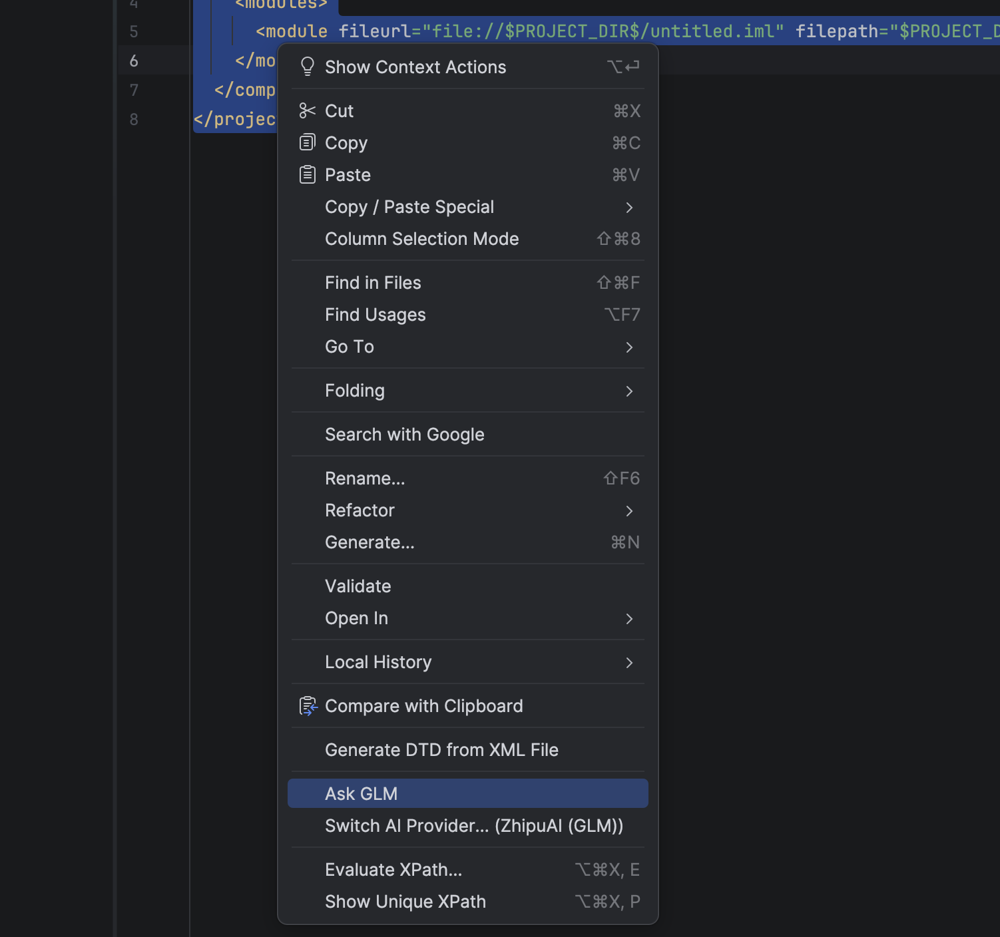
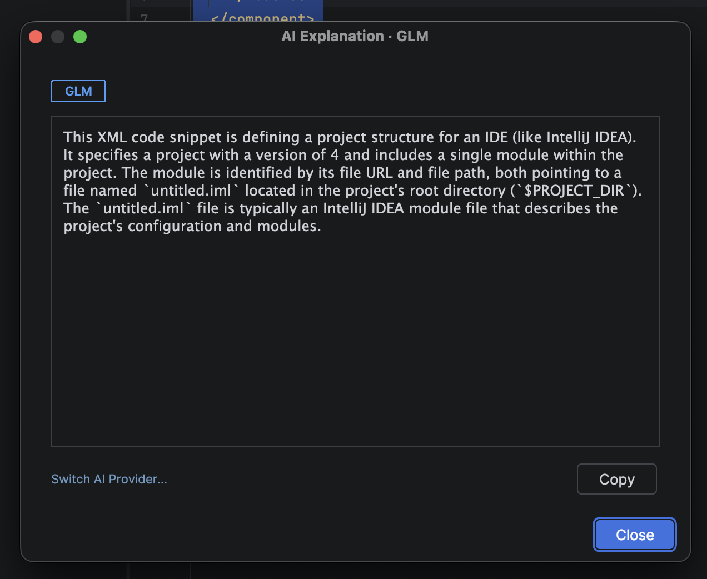

# AI Code Assistant

> Ask AI to explain your code — without leaving your IDE.

A lightweight IntelliJ IDEA plugin that lets you select any code, right-click, and get an instant AI-powered explanation. Supports all major AI providers with your own API key.


---

## Features

- **One right-click away** — select code → right-click → Ask AI
- **6 providers supported** — ChatGPT, Gemini, Claude, DeepSeek, Kimi, GLM
- **Switch providers anytime** — from the right-click menu, no settings page needed
- **Your key, your data** — API keys are stored locally and never uploaded
- **Guided setup** — onboarding wizard on first install

---

## Supported Providers

| Provider | Models |
|----------|--------|
| OpenAI (ChatGPT) | gpt-4o, gpt-4o-mini, gpt-4-turbo, gpt-3.5-turbo |
| Google (Gemini) | gemini-2.0-flash, gemini-1.5-flash, gemini-1.5-pro |
| Anthropic (Claude) | claude-3-5-sonnet, claude-3-5-haiku, claude-opus-4 |
| DeepSeek | deepseek-chat, deepseek-reasoner |
| Moonshot (Kimi) | moonshot-v1-8k, moonshot-v1-32k, moonshot-v1-128k |
| ZhipuAI (GLM) | glm-4-flash, glm-4.7-flash, glm-4-plus, glm-4-long |
| Custom | Any OpenAI-compatible endpoint |

---

## Getting Started

### 1. Install

Search for **"AI Code Assistant"** in IntelliJ IDEA:

`Settings → Plugins → Marketplace → search "AI Code Assistant"`

### 2. Set up your API key

On first launch, a setup wizard will appear. Choose your preferred AI provider and enter your API key.

| Provider | Where to get an API key |
|----------|------------------------|
| OpenAI | [platform.openai.com/api-keys](https://platform.openai.com/api-keys) |
| Google | [aistudio.google.com/apikey](https://aistudio.google.com/apikey) |
| Anthropic | [console.anthropic.com/settings/keys](https://console.anthropic.com/settings/keys) |
| DeepSeek | [platform.deepseek.com/api_keys](https://platform.deepseek.com/api_keys) |
| Moonshot | [platform.moonshot.cn/console/api-keys](https://platform.moonshot.cn/console/api-keys) |
| ZhipuAI | [bigmodel.cn/usercenter/proj-mgmt/apikeys](https://bigmodel.cn/usercenter/proj-mgmt/apikeys) |

### 3. Use it

1. Select any code in the editor
2. Right-click → **Ask ChatGPT** (or whichever provider you chose)
3. Read the explanation in the result dialog
4. Click **Copy** to copy the explanation to clipboard

To switch providers: right-click → **Switch AI Provider…**

---

## Screenshots

| Setup Wizard | Right-click Menu | Result Dialog |
|---|---|---|
|  |  |  |

---

## Configuration

Go to `Settings → Tools → AI Code Assistant` to update your API key, provider, or model at any time.

---

## Privacy

- Your API key is stored in IntelliJ's local settings (`ai-assistant.xml`) and is **never transmitted** to any server other than the AI provider you select.
- Code you select is sent directly to your chosen provider's API. Review their privacy policy before use.

---

## Requirements

- IntelliJ IDEA 2024.1 or later (Community or Ultimate)
- An API key from any supported provider

---

## Contributing

Pull requests are welcome. For major changes, please open an issue first.

```
git clone https://github.com/felixz/ai-code-assistant.git
cd ai-code-assistant
# Open in IntelliJ IDEA, run the 'runIde' Gradle task to launch a sandbox IDE
```

---

## License

[MIT](LICENSE)
